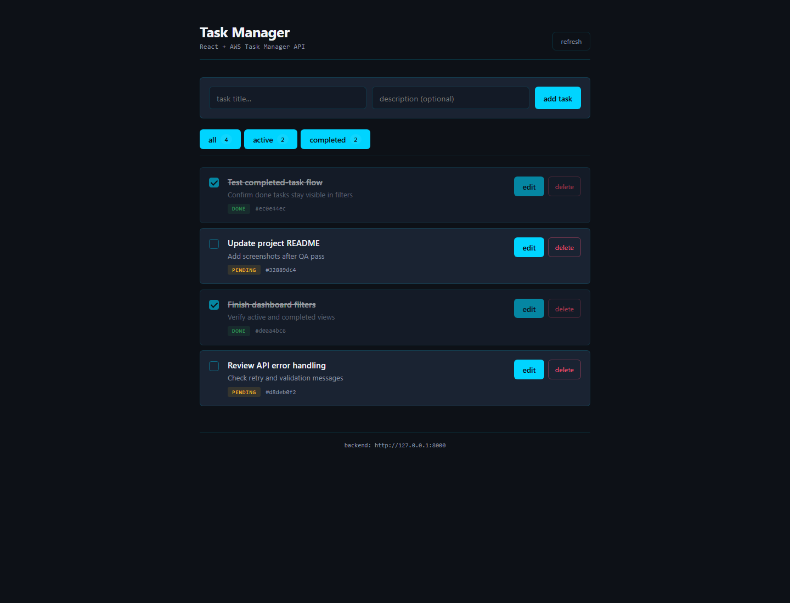
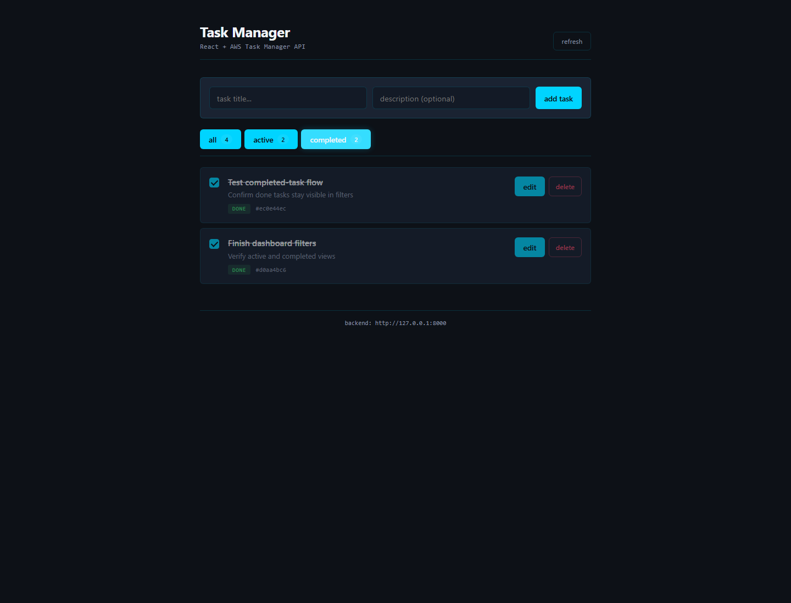
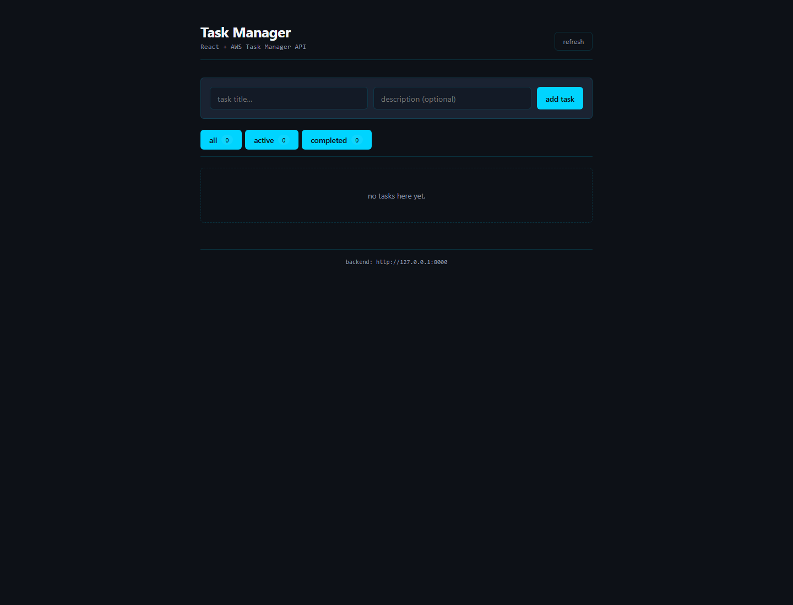
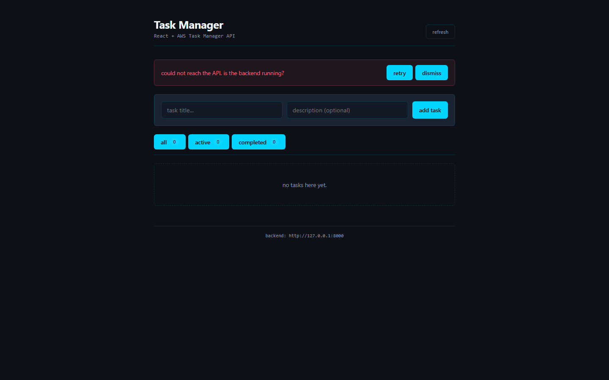
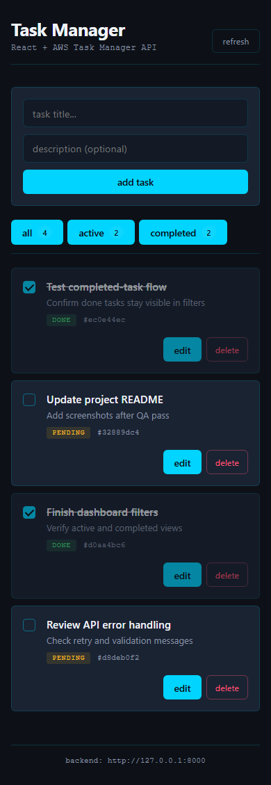

# react-task-manager-dashboard

A React front-end for the [AWS Task Manager API](https://github.com/gabrielchangamire-arch/aws-task-manager-api). It's the dashboard half of a small full-stack app: the FastAPI backend handles persistence, S3 attachments, and AWS deployment; this repo is the user-facing UI that consumes it. I built it to practice React state, API integration, accessible controls, and front-end tests against a real backend.

## Project overview

A clean, responsive task manager dashboard. Users can create, edit, complete, and delete tasks; filter by all / active / completed; see live counts; and recover gracefully when the API is unreachable. State lives entirely in React; the backend is the source of truth.

## Tech stack

- **React 18** with hooks
- **Vite 6** for dev server and build
- **JavaScript** (no TypeScript, by design — keeps the focus on React fundamentals)
- **Plain CSS** with custom properties (no Tailwind, no styled-components)
- **Axios** for HTTP, with a thin `tasksApi` wrapper that normalizes errors
- **Vitest** + **React Testing Library** + **@testing-library/user-event** for tests
- **jsdom** for the test environment

## Features

- View all tasks with status badges and short id chips
- Create a task (title required, optional description)
- Inline edit title and description
- Toggle complete / incomplete with a custom-styled checkbox
- Delete a task
- Filter by **all / active / completed**, with live counts
- Loading spinner on first load
- Error banner with **retry** and **dismiss** when the API is down
- Mobile-responsive layout (single column under 600px)
- Configurable backend URL via `VITE_API_BASE_URL`

## Screenshots

| Dashboard overview | Completed filter |
|---|---|
|  |  |

| Empty state | API error state |
|---|---|
|  |  |



## Local setup

```bash
npm install

cp .env.example .env
# .env defaults to VITE_API_BASE_URL=http://localhost:8000

npm run dev
```

The app runs at http://localhost:5173.

### Running with the backend

The dashboard expects the [AWS Task Manager API](https://github.com/gabrielchangamire-arch/aws-task-manager-api) at the URL in `VITE_API_BASE_URL`. The simplest local setup:

```bash
# in the api repo
cd aws-task-manager-api
.venv/Scripts/python -m uvicorn app.main:app --reload

# in this repo
cd react-task-manager-dashboard
npm run dev
```

The API has CORS configured for `http://localhost:5173` and `http://127.0.0.1:5173` out of the box. To point at a deployed backend, change `VITE_API_BASE_URL` in your `.env`.

## Environment variables

| Variable | Default | Purpose |
|---|---|---|
| `VITE_API_BASE_URL` | `http://localhost:8000` | Base URL of the FastAPI backend. Vite exposes it as `import.meta.env.VITE_API_BASE_URL`. |

`.env` is gitignored. `.env.example` is committed.

## How to run tests

```bash
npm test          # run once
npm run test:watch # watch mode
npm run coverage   # with coverage
```

The suite has **27 tests across 4 files**:

- `tests/App.test.jsx` (15) – integration tests for the dashboard: render, filter, create, complete, delete, error and retry flows. The API service is mocked with `vi.mock`.
- `tests/TaskForm.test.jsx` (4) – form-level behavior: clear after submit, trim, validation, surfacing backend errors.
- `tests/FilterBar.test.jsx` (2) – aria-pressed correctness, filter change.
- `tests/api.test.js` (6) – the `tasksApi` service against a mocked axios instance: success cases, network errors, backend detail messages.

For the QA view of the project, see [`docs/TEST_PLAN.md`](docs/TEST_PLAN.md).

## Front-end notes

- **Component decomposition.** `App` orchestrates state; `TaskForm`, `TaskList`, `TaskItem`, `FilterBar`, `ErrorBanner`, `LoadingSpinner` are each ~50–100 lines and reusable.
- **State design.** Single `tasks` array as source of truth; computed `visibleTasks` and `counts` via `useMemo`; status changes update state optimistically by replacing the row in place.
- **Hooks discipline.** `useState` for local state, `useEffect` for the initial fetch, `useCallback` for `refresh` so the effect is stable, `useMemo` for derived data.
- **Accessibility.** Every interactive element has an `aria-label` or visible label; the filter buttons use `aria-pressed`; the empty state has `role="status"`; the error banner is `role="alert"`.
- **CSS without a framework.** Custom properties for theming, responsive grid that collapses to one column on small screens, transitions on focus / hover, no inline styles.
- **API error handling.** All HTTP errors normalize to `Error` with a friendly message; the UI surfaces the message with a retry path; the user can dismiss without state corruption.
- **Environment-driven config.** Backend URL is `import.meta.env.VITE_API_BASE_URL` so the same build artifact targets dev, staging, and production.

## Testing notes

- **Tests as specification.** Each test name reads like a user story: "shows an error banner when the initial load fails", "removes the task from the list after a successful delete".
- **Multiple test layers.** Unit (FilterBar, TaskForm in isolation), integration (App with mocked service), and service (api.js against mocked axios).
- **Mocking strategy.** The service module is mocked with `vi.mock` in App tests so we exercise real React but don't depend on a running backend. `axios.create` is mocked separately in service tests so we exercise the real `tasksApi` error normalization.
- **Edge-case coverage.** Empty state, validation errors, network errors with retry, dismissal, partial updates, optimistic UI.
- **Determinism.** No timers without `vi.useFakeTimers`, no flake-prone selectors. `cleanup()` runs after each test via `tests/setup.js`.
- **Accessibility selectors.** Tests use `getByRole`, `getByLabelText`, and `findByText` — the same way a screen reader experiences the page — instead of brittle CSS selectors.

## Why I built it this way

I wanted this project to cover the parts that usually matter in SDE, QA, and front-end internship conversations without turning it into a toy demo:

- **SDE.** I built the backend first, then treated its API contract as something the UI had to respect. The error model is consistent, configuration is environment-driven, and the project includes tests with a CI-ready structure.
- **QA.** The 27 tests cover unit and integration boundaries, use accessibility-focused selectors, and mock I/O so the suite can run deterministically.
- **Front-end.** The app uses hooks, component decomposition, accessibility patterns, responsive CSS, error UX, optimistic UI, and environment-driven config without relying on a large UI framework.

## Future improvements

- **Optimistic toggles.** Right now toggle waits on the server. Optimistic updates with rollback on failure would make it feel snappier.
- **Pagination.** Endpoint already supports `limit` / `offset`. Hook up infinite scroll or a "load more" button when task count grows.
- **Attachment UI.** Backend has `/tasks/{id}/attachment` for S3 uploads. Adding a drag-drop component would close the loop.
- **Playwright end-to-end tests.** Vitest covers component / integration. Playwright would cover real-browser flows against a live backend in CI.
- **Auth.** Currently single-tenant. Adding Cognito / JWT auth on the backend with a login screen here would mirror a real production app.
- **Storybook.** Each component is small and reusable; Storybook would make them browsable without running the API.
